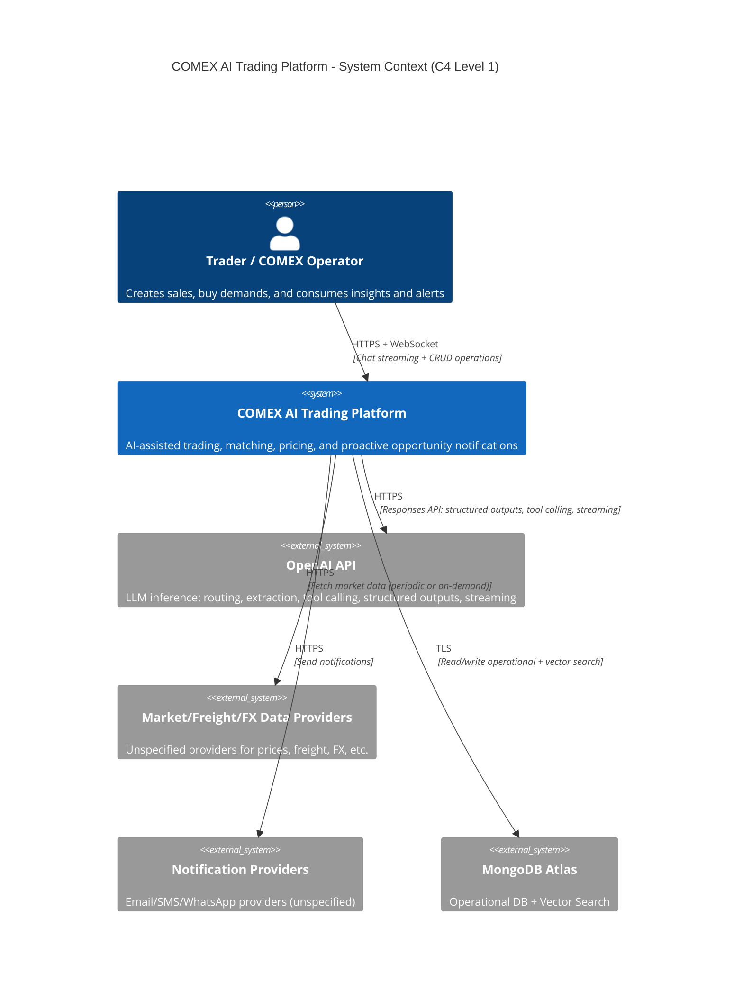
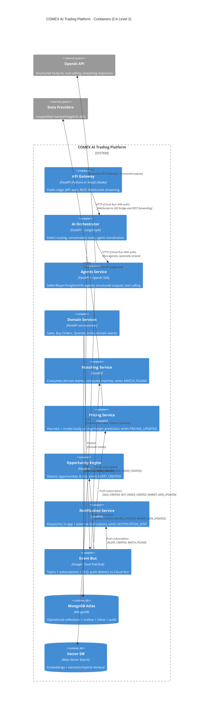
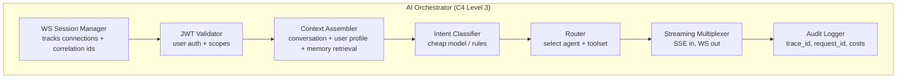
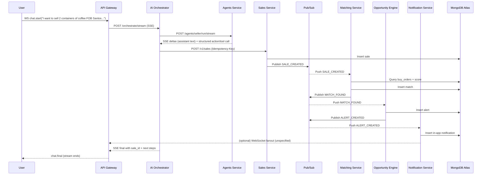
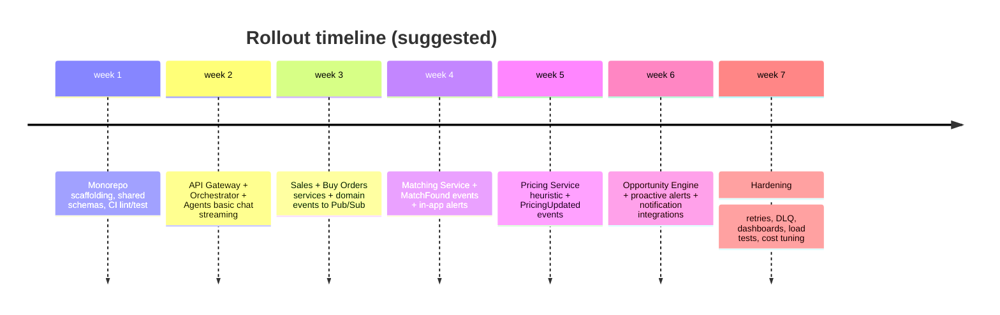
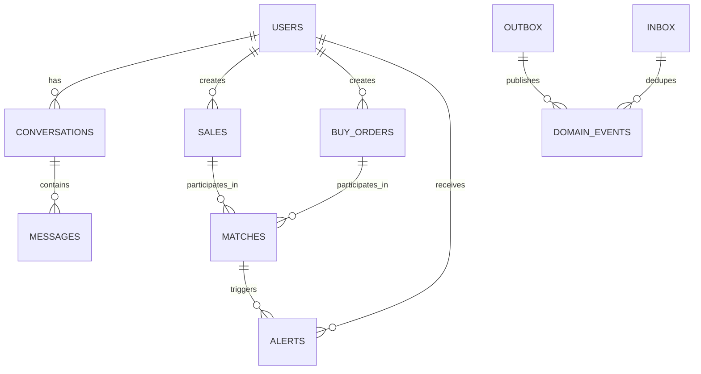

# Production-Ready Backend Specification for a COMEX AI Trading Platform

## Executive summary

This document specifies a complete, implementable backend for a COMEX AI trading platform built as a monorepo and deployed to entity["company","Google Cloud","cloud provider"] using Cloud Run, Pub/Sub, Secret Manager, and Artifact Registry. It is designed so other AIs/engineers can implement it from zero to production with minimal ambiguity. It includes a rigorous C4 specification, precise responsibilities per service, public/internal API contracts (REST + WebSocket streaming), Pub/Sub topics and event schemas, agent I/O JSON schemas, tool interfaces, error and retry semantics, JWT auth, secrets management, observability, scaling and cost notes, Dockerfile patterns, Terraform snippets, CI/CD pipelines, and a rollout plan. “Unspecified” marks where business rules or providers are not defined by the prompt.  

Key technical choices:

- **Language choice**: Use **Python** as the primary reference implementation (FastAPI + Pydantic) because AI orchestration and data/ML workflows are strongest in Python (and the official OpenAI Python SDK is mature). citeturn17view6turn3search4  
  A **Node/NestJS compatibility mapping** is included to satisfy teams that prefer NestJS modules and class-validator/Mongoose patterns. citeturn3search0turn3search2turn3search3  
- **Cloud Run everywhere**: All services run on Cloud Run (stateless containers). For WebSockets, Cloud Run supports them, but they are subject to request timeout (default 5 minutes; configurable up to 60 minutes). citeturn6view0turn6view1  
- **Event-driven from day one**: Pub/Sub is the domain event bus. Push delivery to Cloud Run endpoints is the default (simple operational model); consumers must be idempotent because Pub/Sub is at-least-once by default. citeturn1search0turn18search28  
- **MongoDB Atlas as source of truth + vector search**: Operational data in MongoDB Atlas; embeddings and retrieval in Atlas Vector Search (cost-effective “single database” early on). citeturn2search11turn2search5  
- **Agent pattern**: Orchestrator routes to specialized agents (Seller/Buyer/Insights/Info). Agents use entity["company","OpenAI","ai company"] Structured Outputs (JSON Schema, strict) and optionally function calling to invoke tools (domain services). citeturn17view0turn17view1turn19search3  
- **Security**: External JWT for user auth (RFC 7519), and service-to-service authentication via Cloud Run IAM ID tokens (roles/run.invoker). citeturn15search0turn6view2  
- **Secrets**: Store OpenAI keys, MongoDB URI, JWT signing keys, provider credentials in Secret Manager and mount into Cloud Run; service accounts require the Secret Accessor role. citeturn15search2turn15search14  
- **Connectivity to MongoDB Atlas**: Recommended “secure enough” production baseline is static outbound IP from Cloud Run via VPC egress + Cloud NAT, then whitelist in Atlas IP Access List (or upgrade to Private Service Connect on dedicated Atlas tiers). citeturn2search2turn9search1turn9search3  

## Architecture specification using the C4 model

### System Context

The platform provides a conversational and programmatic interface for COMEX trading workflows: posting sales offers, posting buy demands, generating insights, matching buyers↔sellers, computing margin/pricing predictions, and notifying users of opportunities.

### Container view

Cloud Run is the runtime for all containers. Pub/Sub is the event backbone. MongoDB Atlas is the main database. Vector search is MongoDB Atlas Vector Search (default), with alternatives.

### Component view for the AI Orchestrator (C4 Level 3)

Implementation note: For “cheap model / rules”, prefer small/fast models where latency and cost matter, in line with OpenAI’s model guidance (mini/nano for lower-latency, lower-cost workloads). citeturn17view4  

## Service contracts, WebSocket protocol, and code-level schemas

This section defines: public REST/WS APIs (API Gateway), internal service APIs (Orchestrator/Agents/Domain), and canonical JSON schemas for requests/responses/events/agent I/O.

### Common conventions

**API versioning**: All HTTP endpoints are under `/v1/...`.  
**Correlation**: Every request/event carries:
- `request_id` (UUID string, generated by API Gateway)
- `trace_id` (propagated from OpenTelemetry if configured)
- `user_id` (from JWT `sub` claim)

**Error envelope (REST)**

| Field | Type | Description |
|---|---|---|
| `error.code` | string | Stable code (e.g., `VALIDATION_ERROR`, `UNAUTHORIZED`, `UPSTREAM_TIMEOUT`) |
| `error.message` | string | Human-readable, safe |
| `error.details` | object | Optional structured details |
| `request_id` | string | Correlation id |

**Idempotency**: For write endpoints, accept header `Idempotency-Key` and store it with the created entity to prevent double writes (especially important given retries and at-least-once delivery). Pub/Sub explicitly requires idempotent processing for reliable systems. citeturn18search28  

### Authentication model

**External user auth (API Gateway)**: JWT Bearer tokens (RFC 7519). citeturn15search0  

Recommended JWT claims:

| Claim | Meaning | Notes |
|---|---|---|
| `iss` | issuer | Unspecified (your auth system) |
| `sub` | user id | Required |
| `aud` | audience | e.g., `"comex-api"` |
| `exp` | expiration | Short-lived access tokens recommended |
| `iat` | issued at | Required |
| `scope` | permissions | e.g., `sales:write`, `insights:read` |

**Service-to-service auth**: Cloud Run IAM with ID tokens. Callers must have `roles/run.invoker` on the receiving service, and must send a Google-signed ID token with `aud` set to the Cloud Run service URL; token is passed via `Authorization: Bearer ...` (or `X-Serverless-Authorization`). citeturn6view2  

### WebSocket streaming protocol (frontend ↔ API Gateway)

Cloud Run supports WebSockets, but treat them as long-running HTTP requests with request timeouts up to 60 minutes; ensure clients reconnect and do not rely on session affinity for state. citeturn6view0turn6view1turn8search7  

**Endpoint**: `wss://{api-gateway}/v1/ws/chat`  
**Auth** (choose one; unspecified which you prefer):
- Option A: `Authorization: Bearer <JWT>` in the WebSocket upgrade request (supported by many clients)
- Option B: Query param `?token=<JWT>` (disfavored; leaks in logs)
- Option C: Subprotocol includes JWT (more complex)

**Client → server messages**

| `type` | Purpose | JSON schema (informal) |
|---|---|---|
| `chat.start` | Start a streamed chat turn | `{ "type":"chat.start","request_id":"...","conversation_id":"(optional)","message":{"text":"...","attachments":[]}, "mode":"auto|seller|buyer|insights|info", "metadata":{...} }` |
| `chat.cancel` | Cancel a running stream | `{ "type":"chat.cancel","request_id":"..." }` |
| `ping` | Keepalive | `{ "type":"ping","ts":123 }` |

**Server → client messages**

| `type` | Purpose | JSON schema (informal) |
|---|---|---|
| `chat.accepted` | Request accepted | `{ "type":"chat.accepted","request_id":"...","conversation_id":"..." }` |
| `chat.delta` | Token/text delta | `{ "type":"chat.delta","request_id":"...","delta":"..." }` |
| `chat.tool` | Tool progress | `{ "type":"chat.tool","request_id":"...","tool_name":"create_sale","status":"started|completed|failed","payload":{...} }` |
| `chat.final` | Final answer + structured outcome | `{ "type":"chat.final","request_id":"...","output_text":"...","result":{"intent":"...","action":{...}} }` |
| `chat.error` | Error | `{ "type":"chat.error","request_id":"...","error":{"code":"...","message":"..."}}` |
| `pong` | Keepalive | `{ "type":"pong","ts":123 }` |

**Conversation state**: “Unspecified” whether you model it as:
- server-side session in MongoDB (recommended for reconnect), or
- client supplies prior messages each turn.  

Given Cloud Run session affinity is best-effort and reconnects may land on another instance, persist conversation state outside memory. citeturn6view0turn8search7  

### API Gateway (public REST + internal forwarding)

Primary role: single public entrypoint, JWT validation, request normalization, WebSocket streaming, and conditional routing to Orchestrator.

**Public REST endpoints (minimal but production-grade)**

| Method | Path | Purpose | Auth |
|---|---|---|---|
| `POST` | `/v1/chat` | Non-stream chat response | JWT |
| `POST` | `/v1/sales` | Create sale directly (UI form later) | JWT |
| `POST` | `/v1/buy-orders` | Create buy order directly | JWT |
| `GET` | `/v1/alerts` | List alerts (in-app) | JWT |
| `GET` | `/v1/matches` | List matches | JWT |

**Example JSON schema: `POST /v1/chat`**

| Field | Type | Required | Notes |
|---|---:|---:|---|
| `conversation_id` | string | no | If absent, server creates |
| `message.text` | string | yes | User prompt |
| `mode` | string enum | no | `auto` default |
| `metadata.locale` | string | no | default `en-US` |
| `metadata.timezone` | string | no | default from user (unspecified) |

**Response**: `{ "conversation_id":"...", "output_text":"...", "result":{...}, "request_id":"..." }`

### AI Orchestrator (internal REST/SSE)

Responsibilities:
- intent classification (auto/seller/buyer/insights/info)
- context assembly (user profile, prior conversation, retrieval pointers)
- orchestration of agent run(s)
- returns an SSE stream to API Gateway (which replays via WebSocket)

**Why SSE internally**: OpenAI streaming is SSE-based; Orchestrator can bridge SSE→WS. citeturn17view2  

**Endpoints**
- `POST /v1/orchestrate` (non-stream; internal)
- `POST /v1/orchestrate/stream` (SSE; internal)
- `GET /healthz` (liveness)
- `GET /readyz` (startup/health checks on Cloud Run) citeturn8search1  

### Agents Service (internal)

Responsibilities:
- implement 4 specialized agents (Seller/Buyer/Insights/Info)
- execute OpenAI Responses API calls, with Structured Outputs (strict)
- optionally use tool calling to invoke domain services

Structured Outputs ensure schema adherence; this is recommended over JSON mode when possible. citeturn17view0turn19search2  
Tool calling is a multi-step flow: model returns tool call → your code executes → you send tool output back to the model. citeturn17view1  

**Endpoints**
- `POST /v1/agents/seller/run`
- `POST /v1/agents/buyer/run`
- `POST /v1/agents/insights/run`
- `POST /v1/agents/info/run`
- `POST /v1/agents/{agent}/run/stream` (SSE)

**Canonical Agent Input schema**

| Field | Type | Required | Notes |
|---|---:|---:|---|
| `request_id` | string | yes | correlation |
| `user_id` | string | yes | from JWT |
| `conversation` | object | yes | messages + summary |
| `user_message` | string | yes | current prompt |
| `context` | object | no | RAG results, user prefs |
| `constraints` | object | no | business rules (unspecified) |
| `tools_enabled` | boolean | yes | if false, agent cannot call tools |

**Canonical Agent Output schema**

| Field | Type | Required | Notes |
|---|---:|---:|---|
| `output_text` | string | yes | final assistant output |
| `intent` | string enum | yes | `seller|buyer|insights|info` |
| `action` | object/null | yes | structured action to execute (if not tool-calling inline) |
| `citations` | array | no | “Unspecified” (only if you build RAG citations) |
| `safety` | object | no | “Unspecified” |

**Action schema (shared)**

| Field | Type | Required | Notes |
|---|---:|---:|---|
| `type` | enum | yes | `CREATE_SALE`, `CREATE_BUY_ORDER`, `NONE` |
| `payload` | object | no | depends on type |
| `confidence` | number | yes | 0..1 |
| `validation_errors` | array | no | if extraction incomplete |

### Domain Services (Sales + Buy Orders)

These services own persistence and domain-level validation. They emit domain events after commits.

**MongoDB connection**: Use SRV connection strings (`mongodb+srv://...`) where possible; Atlas typically provides SRV format. citeturn9search0turn9search2  

**Event emission reliability**: See “Event bus and delivery semantics” for outbox pattern guidance.

**Sales Service**
- `POST /v1/sales`
- `GET /v1/sales/{sale_id}`
- `GET /v1/sales` (filters: commodity, status, date range)

**Buy Orders Service**
- `POST /v1/buy-orders`
- `GET /v1/buy-orders/{order_id}`
- `GET /v1/buy-orders` (filters)

**Schema: Sale**

| Field | Type | Required | Unspecified rules |
|---|---:|---:|---|
| `commodity` | string | yes | allowed commodities list |
| `origin` | string | no | “Unspecified” normalization |
| `destination` | string | no | “Unspecified” |
| `incoterm` | string | yes | allowed enum (e.g., FOB/CFR/CIF etc) |
| `price` | number | yes | currency “Unspecified” |
| `volume` | object | yes | units, containers “Unspecified” |
| `available_from` | ISO date | no | |
| `metadata` | object | no | |

### Matching Service

Consumes `SALE_CREATED` and `BUY_ORDER_CREATED`, finds candidate pairs, computes a score, optionally validates or explains with an LLM, stores matches, emits `MATCH_FOUND`.

### Pricing Service

Computes margin predictions and recommended price ranges. Initially: heuristic model; later: ML (XGBoost/time series) is pluggable.

### Opportunity Engine

Consumes `MATCH_FOUND`, `PRICING_UPDATED`, `MARKET_DATA_UPDATED`, creates alert recommendations, stores alerts, emits `ALERT_CREATED`.

### Notification Service

Consumes `ALERT_CREATED` and `MATCH_FOUND`, delivers notifications:
- always: in-app alert stored
- optional: email/WhatsApp/SMS (providers unspecified)

## Event bus design with Pub/Sub semantics, schemas, retries, and idempotency

### Why Pub/Sub, and what the platform must assume

Pub/Sub push subscriptions deliver messages by HTTP POST to a configured endpoint; the endpoint acknowledges by returning an HTTP success status code; otherwise Pub/Sub retries. citeturn1search0turn1search15  
The push request body is JSON; the message payload is in `message.data` base64-encoded. citeturn16search0turn16search0  

Pub/Sub defaults to at-least-once delivery; idempotent processing is required to handle duplicates (including late duplicates after outages). citeturn18search28turn18search28  

### Topics and subscriptions

**Recommended topology**: one main topic for domain events with subscription filters by message attributes.

- Topic: `comex.domain-events.v1`
- Optional DLQ topic: `comex.domain-events.dlq.v1`

Subscription filters: Pub/Sub subscription filters apply to message attributes (not message body). Messages not matching the filter are automatically acknowledged. citeturn12search4turn12search0  

Example filters:
- Matching Service subscription: `attributes.event_type="SALE_CREATED" OR attributes.event_type="BUY_ORDER_CREATED"`
- Pricing Service subscription: `attributes.event_type="SALE_CREATED" OR attributes.event_type="BUY_ORDER_CREATED" OR attributes.event_type="MARKET_DATA_UPDATED"`
- Opportunity Engine subscription: `attributes.event_type="MATCH_FOUND" OR attributes.event_type="PRICING_UPDATED" OR attributes.event_type="MARKET_DATA_UPDATED"`
- Notification subscription: `attributes.event_type="ALERT_CREATED" OR attributes.event_type="MATCH_FOUND"`

### Push authentication to Cloud Run consumers

If you enable authentication for push subscriptions, Pub/Sub signs a JWT and sends it in the Authorization header; subscribers can validate that Pub/Sub signed it. citeturn16search1turn16search4  
Terraform supports configuring `push_config.oidc_token.service_account_email`. citeturn16search2  

Operationally simplest: configure the Cloud Run event consumer endpoints to **require authentication**, then configure the Pub/Sub push subscription to attach an OIDC token minted from a dedicated “pubsub-push-invoker” service account (least privilege). (Exact IAM bindings: environment-specific; unspecified.)

### Canonical event envelope

All domain events share a uniform envelope:

| Field | Type | Required | Notes |
|---|---:|---:|---|
| `event_id` | string | yes | UUID |
| `event_type` | string enum | yes | see list below |
| `event_version` | string | yes | e.g., `"1.0"` |
| `occurred_at` | ISO datetime | yes | producer timestamp |
| `producer` | string | yes | service name |
| `request_id` | string | yes | correlation |
| `user_id` | string | no | if user-caused |
| `payload` | object | yes | event-specific |

Pub/Sub attributes must include at minimum:
- `event_type`
- `event_version`
- `producer`

### Event types

Core set:

- `SALE_CREATED`
- `BUY_ORDER_CREATED`
- `MATCH_FOUND`
- `PRICING_UPDATED`
- `ALERT_CREATED`
- `NOTIFICATION_SENT`
- `MARKET_DATA_UPDATED` (if you ingest market/freight/FX; provider unspecified)

### Retry, DLQ, and error policy

Dead-letter topics: when a subscriber can’t acknowledge, Pub/Sub retries; after a configured number of delivery attempts, Pub/Sub can forward the message to a dead-letter topic. citeturn0search1turn4search2  

Minimum production guidance:
- **Transient errors**: return non-2xx to trigger retry
- **Permanent errors** (schema invalid, missing required fields): publish error telemetry, then **ack** (2xx) to avoid infinite retries; optionally emit `EVENT_REJECTED` event (unspecified)

**Idempotency strategy**
- Maintain a `processed_events` (inbox) collection keyed by `event_id`.
- On receipt:
  1) if `event_id` exists → ack immediately (already processed)  
  2) else process + insert event_id in same transaction as any writes (when feasible).  

This aligns with Pub/Sub’s requirement that consumers be resilient to duplicates. citeturn18search28  

### Exactly-once delivery: optional and caveat

Pub/Sub has an exactly-once feature, but it is not the default. citeturn5search3  
Also, exactly-once delivery is supported for pull subscriptions (per Google Cloud guidance); push architectures generally must still design for duplicates. citeturn5search11turn1search0  

Given the platform is Cloud Run + push subscribers, design for idempotency instead of relying on exactly-once.

### Sequence diagram: sale creation → match → alert → notification

## AI architecture, model selection, RAG/memory, and cost/latency tradeoffs

### OpenAI usage patterns

**Structured Outputs**: Use Structured Outputs (strict) to enforce JSON Schema adherence for agent outputs; it is recommended over JSON mode when possible. citeturn17view0turn19search2  

**Tool calling**: Implement the multi-step tool calling flow: request → tool call → tool execution → tool output → follow-up request → final answer. citeturn17view1turn19search3  

**Streaming**: OpenAI streaming responses are delivered using server-sent events (SSE), enabling partial output before completion. citeturn17view2  

**Prompt caching**: OpenAI prompt caching can reduce latency and input cost significantly for repeated system prompts; it works automatically. citeturn17view3  

### Recommended model routing

OpenAI’s model docs explicitly recommend using `gpt-5.4` as a default for complex reasoning/coding and using smaller variants (`gpt-5.4-mini`, `gpt-5.4-nano`) for lower-latency, lower-cost workloads. citeturn17view4  

A practical split for this platform:

| Workload | Recommended model | Rationale |
|---|---|---|
| Intent classification | `gpt-5.4-nano` | Cheap/fast for routing tasks citeturn17view4 |
| Seller/Buyer extraction | `gpt-5.4-mini` | Better structure accuracy at good cost/latency citeturn17view4 |
| Insights reasoning | `gpt-5.4` | Higher quality multi-step analysis citeturn17view4 |
| Match explanation (optional) | `gpt-5.4-nano` or `mini` | Only for top-N matches to control cost citeturn17view4 |

### Cost and latency tradeoff table

These costs are taken from OpenAI’s official pricing page (standard processing, under the listed context thresholds). citeturn17view5  
Latency descriptors are taken from OpenAI’s models catalog. citeturn17view4  

| Model | Input ($/1M) | Cached input ($/1M) | Output ($/1M) | Latency label | Best for |
|---|---:|---:|---:|---|---|
| `gpt-5.4` | 2.50 | 0.25 | 15.00 | Fast | deepest reasoning, final judgments citeturn17view5turn17view4 |
| `gpt-5.4-mini` | 0.75 | 0.075 | 4.50 | Faster | extraction + subagent tasks citeturn17view5turn17view4 |
| `gpt-5.4-nano` | 0.20 | 0.02 | 1.25 | Faster | classification, high-volume normalization citeturn17view5turn17view4 |

### Memory and retrieval architecture

Default: MongoDB Atlas Vector Search supports creating vector indexes and running semantic/hybrid search over embeddings stored in collections. citeturn2search11turn10search6turn10search28  

Use cases:
- retrieving past conversations and user preferences
- retrieving internal trading playbooks, policies, commodity specs (document store unspecified)
- retrieving executed deals for personalized insights

### Vector DB options comparison

| Option | Strengths | Weaknesses | Best fit |
|---|---|---|---|
| MongoDB Atlas Vector Search | Single DB for ops + vectors; semantic + hybrid search; supports filters citeturn2search11turn10search6 | Vector DB feature depth may lag specialized systems; operational tuning required | Most cost-effective early-stage |
| Pinecone | Purpose-built managed vector DB; serverless cost model; supports namespaces citeturn10search13turn10search10turn10search4 | Additional vendor + networking + ops overhead | Large-scale retrieval workloads |
| Weaviate (Cloud or OSS) | Open-source + managed; hybrid search features documented citeturn10search8turn10search1 | Extra infra to run/operate if self-hosted | Teams needing OSS control |
| pgvector | Store vectors in Postgres; ACID + joins; OSS extension citeturn10search2turn10search19 | Requires Postgres; not aligned with MongoDB-first design | Existing Postgres estate |

Recommendation: Start with Atlas Vector Search, and revisit Pinecone/Weaviate when retrieval cost or performance forces separation.

## Infrastructure, IaC, CI/CD, observability, testing, and rollout plan

### Cloud Run deployment constraints that shape the design

- **Request timeout**: default is 5 minutes, configurable up to 60 minutes; for long-lived WebSocket connections, set a higher timeout and design reconnects. citeturn6view1turn6view0  
- **WebSockets**: supported; avoid relying on stable instance affinity; session affinity is best-effort and can break due to autoscaling/limits. citeturn6view0turn8search7  
- **Concurrency**: higher concurrency can reduce cost if your code can handle parallel requests; Cloud Run explicitly calls out the cost tradeoff. citeturn0search7  
- **Container port**: Cloud Run sets `PORT` env var; services should listen on it (default 8080). citeturn13view0  
- **Static outbound IP**: configure Cloud Run VPC egress through Cloud NAT to get predictable egress IP (needed for Atlas IP allowlisting). citeturn2search2turn2search12turn9search1  

### Secrets management

Use Secret Manager for:
- OpenAI API key
- MongoDB Atlas URI
- JWT signing key(s)
- provider keys (email/WhatsApp)
- any third-party API keys (market data)

To let Cloud Run access secrets, the service identity must have `roles/secretmanager.secretAccessor`. citeturn15search2turn15search14  

### Pub/Sub push delivery to Cloud Run

Push subscriptions:
- Pub/Sub delivers as HTTPS POST
- endpoint acknowledges with HTTP success; otherwise messages are resent. citeturn1search0turn1search15  
Message payload is base64 in `message.data`. citeturn16search0  

### MongoDB Atlas connectivity and security

- Atlas uses IP Access Lists to allow IP addresses or CIDR ranges. citeturn9search1  
- For secure Cloud Run → Atlas with allowlist, configure static outbound IP via VPC egress + Cloud NAT and whitelist that IP. citeturn2search2turn9search1  
- For more secure private connectivity on dedicated Atlas clusters, Atlas supports Private Endpoints on GCP via Private Service Connect. citeturn9search3turn9search20  

### Dockerfile patterns for Cloud Run

Pattern requirements:
- Use a single process that binds to `$PORT`. citeturn13view0  
- Provide `/healthz` and `/readyz` endpoints and configure Cloud Run health checks (startup/liveness). citeturn8search1  

Minimal Python pattern (illustrative; exact base image unspecified):
- build: install deps
- run: uvicorn on `$PORT`

### Terraform core resources (snippets)

These snippets are illustrative; variables/environment separation is “unspecified”.

**Artifact Registry repo**
- Terraform resource exists in the Google provider and is recommended for Docker images. citeturn4search0turn4search4  

**Cloud Run v2 service**
- Use `google_cloud_run_v2_service` per Terraform registry docs; Cloud Run provides examples of configuring container port and env vars. citeturn1search2turn13view0  

**Pub/Sub topic + subscriptions with push**
- Push subscriptions ack by HTTP 200; include OIDC token configuration in Terraform. citeturn1search0turn16search2  
- Dead-letter policy supported via Terraform resource docs. citeturn4search2turn0search1  

**VPC connector**
- Terraform resource exists for serverless VPC access connectors. citeturn4search3turn2search12  

### CI/CD with GitHub Actions and Workload Identity Federation

Deploy images to Artifact Registry and Cloud Run using GitHub Actions:
- Use `google-github-actions/auth` (supports Workload Identity Federation; recommended over long-lived service account keys). citeturn14search0turn14search3  
- Use `google-github-actions/deploy-cloudrun` for deployment flows. citeturn1search6turn1search3  
Official deployment guidance exists for deploying to Cloud Run with GitHub Actions workflows. citeturn1search3turn14search28  

### Observability

- Use structured logging: JSON payload in `jsonPayload` enables better querying and indexing. citeturn7search1  
- Use OpenTelemetry on Cloud Run: Google provides guidance to run the Google-built OpenTelemetry Collector on Cloud Run to export OTLP logs/metrics/traces. citeturn7search0turn7search8  
- Pub/Sub has OpenTelemetry tracing capability for client ops. citeturn7search12  

### Testing strategy

**Unit tests**
- Pure functions: match scoring, pricing heuristics, schema validation

**Integration tests**
- MongoDB: test CRUD + indexes
- Pub/Sub: use emulator (setup unspecified), validate push endpoint parsing and idempotency behavior
- OpenAI: mock with contract tests; validate structured outputs conformance

**End-to-end tests**
- “happy path” flow: `sale created → event emitted → match found → alert created → notification stored`
- WebSocket streaming: test `chat.delta` ordering and cancellation

### Rollout plan

### Entity relationships (MongoDB collections)

## Implementation guidance per service (concise but implementable)

This section lists each service’s responsibilities and key implementation notes. Where a business rule is not specified, it is marked explicitly as “Unspecified”.

### API Gateway

- FastAPI WebSocket server (or NestJS gateway). FastAPI supports handling WebSockets and managing disconnects. citeturn3search4  
- JWT validation (RFC 7519). citeturn15search0  
- For Cloud Run WebSockets, set timeout up to 3600s if you expect long sessions; design reconnect logic. citeturn6view0turn6view1  
- Bridges Orchestrator SSE → WS messages.

### AI Orchestrator

- Routes by intent (auto or explicit mode).
- Uses a small model for intent classification where possible (cost control). citeturn17view4turn17view5  
- Stores conversation state pointers in MongoDB (schema unspecified).
- Uses Cloud Run service-to-service authentication to call Agents service where configured. citeturn6view2  

### Agents Service

- Implements four agent prompts and schemas.
- Uses Structured Outputs (strict) to return schema-adherent JSON. citeturn17view0turn19search2  
- Uses OpenAI streaming via SSE. citeturn17view2  
- Optional tool calling: implement the tool-call loop. citeturn17view1  
- Optional prompt caching benefits: reduces latency and input costs for repeated system prompts. citeturn17view3  

### Sales Service and Buy Orders Service

- Validate incoming payload; enforce idempotency.
- Persist to MongoDB Atlas; prefer SRV connection strings. citeturn9search0  
- Emit `SALE_CREATED` / `BUY_ORDER_CREATED` to Pub/Sub.

### Matching Service

- Pub/Sub push consumer parsing `message.data` base64 envelope. citeturn16search0turn1search0  
- Must be idempotent. citeturn18search28  
- Produces `MATCH_FOUND`.

### Pricing Service

- Heuristic pricing/margin engine (provider data sources unspecified).
- Produces `PRICING_UPDATED`.

### Opportunity Engine

- Consumes matches + pricing updates → creates alerts.
- Produces `ALERT_CREATED`.

### Notification Service

- Consumes alerts/matches.
- Always writes to in-app alert store; external providers optional (unspecified).

### NestJS parity mapping (if you choose Node)

This is a compatibility cheat-sheet; the Python design remains canonical.

| Concern | Python stack | NestJS stack |
|---|---|---|
| HTTP APIs | FastAPI | Controllers/Providers |
| WS | FastAPI WebSockets | Gateways (`@WebSocketGateway`) citeturn3search3 |
| Validation | Pydantic | ValidationPipe + class-validator citeturn3search0 |
| MongoDB | Motor/ODM | `@nestjs/mongoose` / Mongoose citeturn3search2turn3search1 |

---

**Unspecified items checklist (for engineering alignment)**
- Commodity taxonomy, units, currencies
- Matching score weights and thresholds
- Market/freight/FX data providers and schemas
- Notification channels/providers and templates
- User onboarding, identity provider, token issuance
- RAG document sources and governance policies